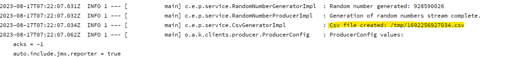
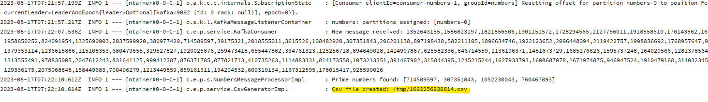

# Prime Number Producer MS

### Create and start using docker-compose

* Clone both producer and consumer repositories:
```
https://github.com/stuckata/prime-number-producer
```
```
https://github.com/stuckata/prime-number-consumer
```

* Create .jar archives needed by docker-compose by running for each ms these Gradle tasks:
```
clean
```
```
bootJar
```

* Run docker-compose by using this command in the root folder of prime-number-producer ms:
```
docker-compose up -d
```

***Both producer and consumer should now be up and running.***

### Check created csv files one with produced 100 random numbers and the other with prime numbers
* On creation of csv file a log with path and file name is logged respectively in producer and consumer 


* Copy it from within container to your local drive using this command:
```
docker cp <containerId>:/file/path/within/container /host/path/target
```
* To see the ***containerId*** use the following command: 
```
docker ps
```